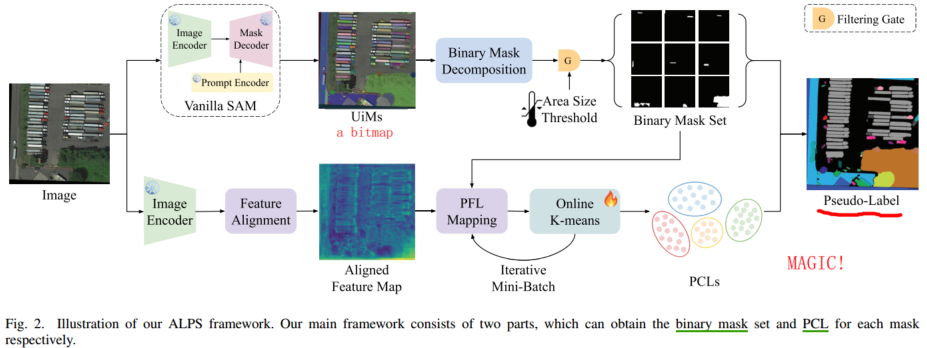

## how to run the repo

TLDR: see `run.sh`

- clone the repo and set up the environment using uv

```
git clone https://github.com/PointCloudYC/ALPS.git
cd ALPS
# optional: create uv project 
uv init
# Create a virtual environment with uv
uv venv
source .venv/bin/activate

# install pytorch, torchvision, scikit-learn, etc.
# see https://pytorch.org/get-started/previous-versions/
uv pip install torch==1.12.1+cu113 torchvision==0.13.1+cu113 torchaudio==0.12.1 --extra-index-url https://download.pytorch.org/whl/cu113
uv pip install scikit-learn==1.3.2

# install vanialla SAM w. edit mode
# Check if segment-anything folder exists
if [ ! -d "segment-anything" ]; then
    echo "Cloning segment-anything repository..."
    git clone https://github.com/facebookresearch/segment-anything.git
else
    echo "segment-anything repository already exists"
fi
uv pip install -e .
```

- Download a SAM checkpoint (choose one):
  - ViT-H: ViT-H SAM Model
  - ViT-L: ViT-L SAM model
  - ViT-B: ViT-B SAM model
```
wget https://dl.fbaipublicfiles.com/segment_anything/sam_vit_h_4b8939.pth
# or
wget https://dl.fbaipublicfiles.com/segment_anything/sam_vit_l_0b3195.pth
# or
wget https://dl.fbaipublicfiles.com/segment_anything/sam_vit_b_01ec64.pth
```

- configure dataset structure as follows:

```
├──dataset_path
│   ├── img_dir
│   │   ├── train
│   │   │   ├── xxx{img_suffix}
│   │   │   ├── yyy{img_suffix}
│   │   │   ├── zzz{img_suffix}
│   │   │   ├── ....
│   │   ├── val
│   │   │   ├── xxx{img_suffix}
│   │   │   ├── yyy{img_suffix}
│   │   │   ├── zzz{img_suffix}
│   │   │   ├── ....
│   │   ├── test
│   │   │   ├── xxx{img_suffix}
│   │   │   ├── yyy{img_suffix}
│   │   │   ├── zzz{img_suffix}
│   │   │   ├── ....
```

- run the code; details see `main.py`

```
python main.py --root_dir ../dataset_path --image_suffix .png --sam_checkpoint ../sam_vit_h_4b8939.pth --model_type vit_h --number_clusters 46 --vis True
```

## Core component analysis

The repo implements the ALPS framework for auto-labeling and pre-training in remote sensing segmentation, leveraging the Segment Anything Model (SAM) and online K-means clustering.
Pipeline Steps (as in main.py):

- Mask Generation: Use SAM to generate masks for each image.
- Feature Extraction: Use the ViT encoder from SAM to extract features for each mask.
- Online K-Means Training: Cluster mask features using online K-means.
- Prediction: Assign cluster labels to each mask using the trained K-means.
- Instance Mask Generation: Generate instance masks based on clustering results.

Key Files & Their Roles

- main.py: Orchestrates the full pipeline, parses arguments, and calls each step in order.
- sam_vit.py: Implements the Vision Transformer (ViT) encoder, adapted from SAM
- utils/model.py: Builds the ViT encoder with the correct configuration for each model type (vit_h, vit_l, vit_b).
- utils/dataset.py: Custom PyTorch datasets for images, masks, and mask vectors.
- utils/utils.py: Helper functions for mask visualization, filtering, saving, etc.

Core Classes/Functions

- ImageEncoderViT (in sam_vit.py): The main ViT backbone for feature extraction.
- build_sam_vit (in utils/model.py): Factory for creating the correct ViT encoder.
- Custom_Dataset, Mask_Vec_Dataset, Mask_Vec_TestDataset (in utils/dataset.py): Data loaders for images and mask features.
- generate_all_masks, use_encoder_align_mask_feature, online_k_means_clustering_train, online_k_means_clustering_test (in main.py): The main steps of the pipeline.

External Dependencies

- Segment Anything Model (SAM): Used for mask generation and as a feature extractor.
- scikit-learn: For K-means clustering.
- PyTorch: For all deep learning components.

## Summary Table

| Step | Component/Script | Description |
|------|-------------------------|------------------------------------------------------------------|
| 1 | main.py | Entry point, argument parsing, pipeline orchestration |
| 2 | sam_vit.py | ViT encoder implementation (core of SAM) |
| 3 | utils/model.py | Model builder for different ViT variants |
| 4 | utils/dataset.py | Custom datasets for images/masks |
| 5 | utils/utils.py | Helper functions (visualization, filtering, saving, etc.) |
| 6 | External: segment-anything | Mask generation and feature extraction (via SAM) |
| 7 | External: scikit-learn | Online K-means clustering |

## detailed analysis from paper perspectives

According to the ALPS framework (see Fig. 2), the process consists of two main stages: binary mask generation and mask class association. The first stage can be further divided into two steps: prediction of unlabeled instance masks (UiMs) and binary mask generation. The second stage involves feature extraction and alignment, followed by feature clustering.

Here's how these components map to the code:

1. **UiMs prediction and binary mask generation**:
   - Implemented in `generate_all_masks()` function in main.py
   - Uses SAM to generate masks for each image in the dataset
   - Code: `masks, scores, logits = predictor.predict(...)` 

2. **Feature extraction and alignment**:
   - Implemented in `use_encoder_align_mask_feature()` function in main.py
   - Uses the ViT encoder from SAM to extract features for each mask
   - Code: `mask_features = encoder(transformed_image, mask_inputs)`

3. **Feature clustering**:
   - Implemented in `online_k_means_clustering_train()` and `online_k_means_clustering_test()` functions in main.py
   - Uses MiniBatchKMeans from scikit-learn for online clustering, which processes data in small batches
   - Online K-means clustering differs from standard K-means by:
     - **Processing data in mini-batches** rather than all at once, making it memory-efficient for large datasets
     - **Incrementally updating cluster centers** as new data arrives
     - **Allowing for dynamic adaptation** to new patterns in the data
   - The implementation uses a two-phase approach:
     1. Training phase: `online_k_means_clustering_train()` builds the clustering model
        - Code: `kmeans = MiniBatchKMeans(n_clusters=args.number_clusters, batch_size=args.batch_size, ...)`
        - Processes mask feature vectors in batches to find optimal cluster centers
     2. Testing/inference phase: `online_k_means_clustering_test()` applies the trained model
        - Code: `cluster_labels = kmeans.predict(mask_features)`
        - Assigns each mask to its nearest cluster center
   - This approach enables efficient processing of large datasets that wouldn't fit in memory
   - The number of clusters is controlled by the `--number_clusters` parameter

4. **Instance mask generation**:
   - Final step that generates labeled instance masks based on clustering results
   - Implemented in the prediction and visualization parts of main.py
   - Code: `save_colored_mask(masks, cluster_labels, ...)`



### additional analysis

5. **dataset creation**

   - Implemented in `Custom_Dataset` class in `utils/dataset.py`
   - The dataset is created by the `generate_all_masks()` function in `main.py`
   - The dataset is saved in the `dataset_path` directory
   - The dataset will use the `__getitem__()` function to get the image name, image and masks

6. **online k-means clustering dataset**

   - Implemented in `Mask_Vec_Dataset` class in `utils/dataset.py`
   - The dataset is created by the `generate_all_masks()` function in `main.py`
   - The dataset is saved in the `dataset_path` directory
   - The dataset will use the `__getitem__()` function to get masks only

7. **SAM model**

   - Implemented in `sam_vit.py`
   - The model is created by the `build_sam_vit()` function in `utils/model.py`
   - The model is saved in the `dataset_path` directory
   - The model will use the `__call__()` function to get the mask features


## How to Customize

- Change the number of clusters (--number_clusters).
- Adjust dataset paths and image suffixes.
- Use different SAM model types/checkpoints.
- Modify mask filtering thresholds and other parameters as needed.